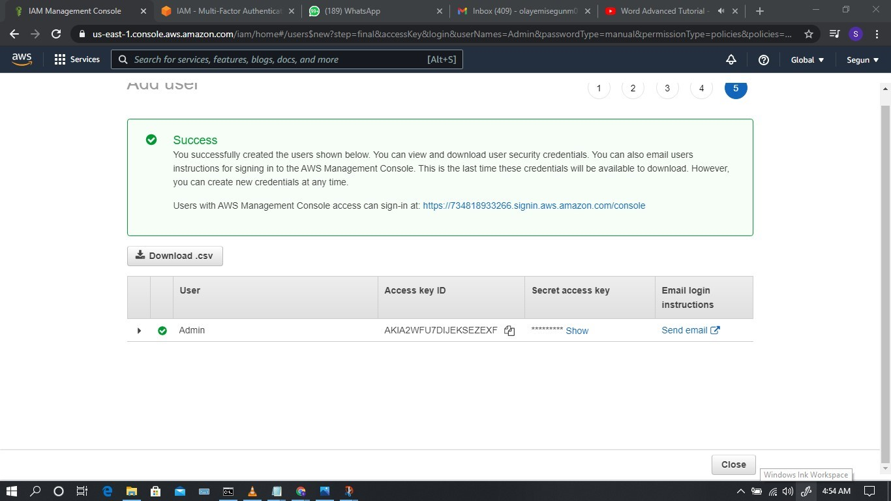

# Identity and Access Management (IAM)

## Task

In an organization demo.io, they have 5 people in different unit as listed:

i.   Dele     technical expert 

ii.  Ade      technical support

iii. Segun    Storage expert

iv.  Gbenga   Admin support

v. Sharon  Finance head

Your task in this lab is to create 

1. Groups and add the corresponding user

I created users individually for the people in the organisation baering their individual names and added policies according to their their roles in the organisation, I then then created group names "Expert" "Support" then "Finance" and added the individual users according to their roles in the organisation 

2. Enforce a password policy

I enforced a passowrod policy stated below;
8 character long
Must include an uppercase letter
Must include integers
Password reset upon next login

3. Perform clean up operations

I then performe a clean operation by clearing all operations performed in the IAM service

Below are screenshoot for final output of the user group created and their individual users.

Guides:
https://docs.aws.amazon.com/IAM/latest/UserGuide/introduction.html
