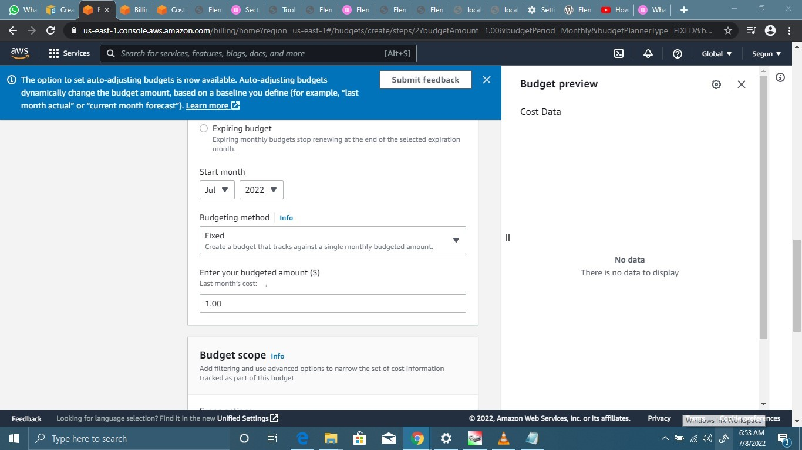

# AWS Free Tier usage alerts using AWS Budgets

## Task:

1. Create a cost budget
2. Create a usage budget

NB: Include Budget alarm at your preferred threshold.

TO CREATE A COST BUDGET

I signed in to the AWS Management Console and open the AWS Cost Management console 

In the navigation pane, I choose Budgets.

At the top of the page, I choose Create budget.

For Choose budget type, I choose Cost budget. Then, selected Next.

Under Set budget amount, for Period, I choose how often I want the budget to reset the actual. I selected Monthly for every month.

For Budget effective date, I choose Recurring budget for a budget that resets after the budget period.

For Budgeting method, I selected the way that I want my budget amount to be determined each budget period:

I selected "Fixed"

Under Budget scoping - for Advanced options, I choose Use amortized costs

Then choose Next.

I choose Add an alert threshold.

Under Set alert threshold, for Threshold, I entered the amount that must be reached for me to be notified. 

Next to the amount, I choose % of budgeted amount to be notified when your costs exceed the threshold percentage.

Next to the threshold, I choose Actual to create an alert for actual spend. 

Under Notification preferences - for Email recipients, I entered the email addresses that I want the alert to notify. 

NB: I set two alert, one at 25% and the other at 80%

Then choose Next.

I Reviewed my budget settings, and then choose Create budget.

TO CREATE USAGE BUDGET

I signed in to the AWS Management Console and open the AWS Cost Management console 

In the navigation panel, I choose Budgets.

At the top of the page, I choose Create budget.

For Choose budget type, I choose Usage budget. Then, choose Next.

Under Choose what you’re budgeting against, for Budget against, I choose Usage type groups.

Under Set budget amount, for Period, I choose how often I want the budget to reset the actual,I selected Monthly for every month.

For Budget effective date, I choose Recurring budget for a budget that resets at the end of each budget period. 

For Budgeting method, I selected the way that i want my budget amount to be determined each budget period: I choose "Fixed"

I choose Add an alert threshold.

Under Set alert threshold, for Threshold, I entered the amount that must be reached for you to be notified.

Next to the amount, I choose % of budgeted amount to be notified when your usage exceeds the threshold percentage.

Next to the threshold, choose Actual to create an alert for actual usage.

Under Notification preferences - for Email recipients, I entered the email addresses that I want the alert to notify.

NB: I set budget alert at 80%

I choose Next.

I reviewed My budget settings, and then choose Create budget.

Guide:
https://docs.aws.amazon.com/cost-management/latest/userguide/budgets-create.html
